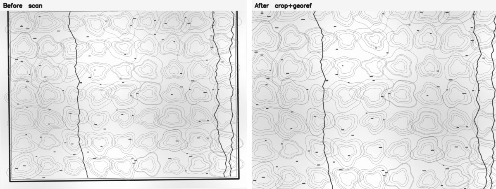
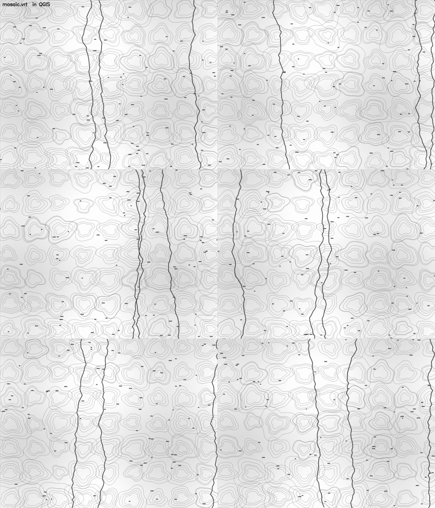

# 历史地形图批量裁切与配准工具包

**把一批扫描的老地图，自动变成尺寸统一、带地理坐标、能直接进 GIS 的数据。**

[](https://www.python.org/downloads/)
[](LICENSE)
[](#)
[](requirements.txt)

适用于民国五万分之一地形图一类的**分幅历史地图扫描件**。
从"一堆歪斜带黑边的 jpg"到"能在 QGIS 里整片拼接的 GeoTIFF"。

> **完全没用过 Python / 命令行？** 请先看 [新手从这里开始.md](新手从这里开始.md) ——
> 那份文档从"怎么装 Python"讲起，全程只需双击 `.bat` 文件。
> 本文面向有一点技术基础的使用者。



*左：原始扫描件（歪斜、带图框黑边、四周纸白）。右：纠斜并裁到内容边界之后。*



*各图幅按编号行列排布后的拼接效果（对应 `mosaic.vrt`）。*

> 上图使用程序生成的**合成示例数据**绘制，目的是展示流程效果，
> 不涉及任何真实地图的版权。换成你自己的成果截图会更有说服力，
> 替换 `docs/images/` 下的同名文件即可。

---

## 目录

- [它能做什么](#它能做什么)
- [快速开始](#快速开始)
- [准备工作](#准备工作)
- [参数怎么调](#参数怎么调)
- [常见问题](#常见问题)
- [目录结构](#目录结构)
- [原理](#原理)
- [已知限制](#已知限制)
- [贡献](#贡献)
- [许可](#许可)

---

## 它能做什么

它解决三个具体问题：

| 问题 | 解决方式 |
|---|---|
| 扫描件歪、带黑边、图廓外全是纸白 | 自动纠斜 + 找到图廓 + 裁到内容边界，输出统一尺寸 |
| 图幅没有坐标信息，GIS 里无法定位 | 按图号规则换算出经纬度，写成 GeoTIFF |
| 几百幅零散文件无法整体查看 | 生成一个 VRT 索引，拖进 QGIS 就是整片拼接图 |

**设计原则：宁可留白，绝不切内容。**
地图裁掉一块就永久丢失，边缘多留几毫米只是难看。
所以流程里所有"不确定"的环节都朝保守方向倒。

全程本地运行，不联网，不需要任何账号或密钥。

---

## 快速开始

```bash
# 1. 安装依赖（rasterio 自带 GDAL，无需另外配置）
pip install -r requirements.txt

# 2. 生成配置
cp config.example.yaml config.yaml      # Windows: copy config.example.yaml config.yaml

# 3. 生成示例数据并跑通全流程（可选，但强烈建议先跑一次）
python scripts/00_make_sample.py
python scripts/01_crop.py
python scripts/02_georef.py
python scripts/03_build_vrt.py

# 4. 自查
python scripts/tools/check_outputs.py
```

Windows 用户也可以直接双击 **`一键运行.bat`**：
它会自动检查 Python 环境、安装缺失的依赖、依次跑完全部流程，最后打开成果文件夹。

跑完看两个地方：

- `work/01_crop/` — 裁好的灰度 PNG，尺寸由配置决定，**双击就能看**
- `work/02_geo/mosaic.vrt` — 拖进 QGIS / ArcGIS 就能看到整片拼接

确认没问题后，把**你自己的扫描件**放进 `input/`，删掉示例图，重跑 01~03 即可。

> **先单幅试跑。** 参数没调好就全量跑，几百幅要重来一遍。
> 三个脚本都支持只处理指定文件：
> ```bash
> python scripts/01_crop.py 2108-甲幅
> ```

---

## 准备工作

### 文件命名

默认要求文件名形如 `<四位图号>-<图名>.jpg`，例如：

```
2108-瑪瑙觀.jpg     ← 图号 2108 = 第 21 列 第 8 行
0119-花凉亭.jpg
```

**图号的前两位是列号 C，后两位是行号 R** —— 这是民国五万分之一地形图常见的
编排方式。如果你的图集用的是别的编号体系，改 `config.yaml` 里的
`grid.filename_regex` 与 `grid.ccrr` 即可，不用动代码。

### 一定要排除非图幅文件

接图表、封面、说明页**必须**写进 `crop.exclude`：

```yaml
crop:
  exclude: ["index", "封面", "说明"]
```

否则它们会被当成一幅地图走完整流程，产出一张毫无意义的"图幅"。
这是实践中最容易忽略的坑——它不会报错，只会悄悄多出一个文件。

### 确认图号规则

**动手前先核对 2~3 幅。** 打开一幅原图，看它图廓右上角标的经度，
和你按 `west = origin_lon - step_lon × C` 算出来的对不对得上。

以本工具包默认值为例：

| 图号 | C | R | 算出西边界 | 算出北边界 |
|---|---|---|---|---|
| 2108 | 21 | 8 | 116.25 − 0.25×21 = **111.00°** | 33.333 − 8/6 + 1/6 = **32.1667°** |

对应的图廓注记应当是 `111°00′` / `32°10′`（32.1667° = 32°10′）。
**对不上就说明规则不对，先改配置再跑批量。**

---

## 参数怎么调

全部集中在 `config.yaml`，最常改的三个：

| 参数 | 作用 | 调大的后果 | 调小的后果 |
|---|---|---|---|
| `crop.density_threshold` | 判定"这一行有内容"的墨迹占比门槛 | 裁得更紧，稀疏图幅可能被切掉内容 | 更保守，边缘留白多 |
| `crop.safe_ratio` | 内容框小于外框此比例时判为不可信 | 更信检测结果，有切内容风险 | 更多图幅走安全兜底（留白但绝不切） |
| `georef.east_shift_m` | 整体东移，用于对齐现代底图 | — | — |

**这个工具的设计取向是"宁可留白，绝不切内容"。**
所以 `safe_ratio` 默认偏保守，触发兜底的图幅会在报告里标成 `safe`。

`work/01_crop/crop_report.json` 里每幅都记了实际用的比值：

```json
{"file": "2108-甲幅", "flag": "ok", "ratios": [0.997, 0.982], ...}
```

`ratios` 明显小于 1（比如 0.6）而 `flag` 是 `safe`，说明那一幅的检测结果
不可信，值得单独看一眼。**`safe` 不等于处理错误**，只是走了保守路径。

更多调参依据见 [docs/参数调优.md](docs/参数调优.md)。

---

## 常见问题

**Q: 裁出来的图上下各留了一大条白边。**
外框检测把图廓外的注记也框进去了，或内容边界识别得太保守。
先看 `crop_report.json` 里那幅的 `outer` 和 `ratios`。可以试着
把 `density_threshold` 调大 0.02 再单幅重跑。

**Q: 图幅内容被切掉了一块。**
立刻把那幅的文件名加进 `crop.force_safe`，它就会走"整幅保留"路径。
然后把这幅的编号记录下来——这类样本是调参最有价值的输入。

**Q: 配准时说"文件名不符合规则, 已跳过"。**
你的命名和 `grid.filename_regex` 不匹配。先用 `--dry-run` 看换算结果：
```bash
python scripts/02_georef.py --dry-run
```

**Q: 图在 GIS 里整体偏了。**
历史地图与现代底图之间常有系统性偏移。用 `georef.east_shift_m` 做整体平移。
注意偏移量依赖中心纬度：`Δlon = shift / (111320 × cos(纬度))`。
**改了纬度就一定要重算这个值**，否则矢量与栅格之间会悄悄错开。

**Q: 某几幅位置就是不对（编号与图集接图表不符）。**
用 `grid.overrides` 逐幅强制指定，不用改文件名：
```yaml
grid:
  overrides:
    "0122-龍湖": [1, 21]      # 文件名编号 22，实际在第 21 行
```
这类问题往往成对出现：编号错位常常是"整体差一格"，
发现一幅后建议顺带检查它上下左右相邻的几幅。

**Q: 中文路径下报错。**
脚本已用 `PIL` 读图、`imencode+tofile` 写图来规避 Windows 中文路径问题。
如果仍出错，请把工作目录放到**不含中文和空格**的路径下。

---

## 目录结构

```
historical-map-toolkit/
├── 一键运行.bat                 Windows 双击跑完全流程（推荐）
├── 生成示例数据.bat             生成测试用示例数据
├── 新手从这里开始.md            零基础操作手册
├── 需要准备的软件.md            软件清单（必装/建议/不需要）
├── 简介与参考资料.md            项目简介、方法来源、引用格式
├── 思维导图.md                  方案全貌（mermaid / XMind 大纲）
├── config.example.yaml          配置模板（复制成 config.yaml 再改）
├── requirements.txt
├── input/                       扫描件放这里
├── work/
│   ├── 01_crop/                 裁切成果 + crop_report.json
│   └── 02_geo/                  配准成果 + sheet_manifest.csv + mosaic.vrt
├── docs/
│   ├── 原理与踩坑.md
│   ├── 参数调优.md
│   └── images/                  示意图（README 引用）
└── scripts/
    ├── 00_make_sample.py        生成合成示例（仅用于自测）
    ├── 01_crop.py               纠斜 → 外框 → 内容边界 → 定尺寸输出
    ├── 02_georef.py             图号 → 经纬度 → GeoTIFF + 金字塔
    ├── 03_build_vrt.py          生成总镶嵌 VRT
    └── tools/
        └── check_outputs.py     成果自查
```

`config.yaml`、`input/`、`work/` 已在 `.gitignore` 中排除。

---

## 原理与来源

想弄清每一步为什么这么做、以及哪些做法试过但失败了，
见 [docs/原理与踩坑.md](docs/原理与踩坑.md)。

方法思路参考了历史地图数字化的既有研究，**详细出处、引用格式与 BibTeX 见
[简介与参考资料.md](简介与参考资料.md)**。

与已有方案的主要差异：

| 环节 | 本工具的做法 | 原因 |
|---|---|---|
| 纠斜 | 投影方差法，**独立于图框检测** | 图廓线缺失时不应导致纠斜失败 |
| 图框检测 | 形态学长核开运算 + 多阈值降级 | 针对"图廓线偏淡导致单边漏检" |
| 内容边界 | 墨迹密度游程自适应 | 各图幅边缘留白宽度差异极大 |
| 失败处理 | 宁可留白，**绝不切内容** | 裁掉的内容不可恢复 |
| 赋坐标 | 直接由图号算经纬度矩形 | 图号本身编码了经纬度，无需控制点 |
| 运行环境 | rasterio（自带 GDAL） | 免装 GDAL / ArcGIS，降低部署门槛 |

一句话概括流程：

```
扫描件 → 纠斜 → 找外框 → 排除图廓线带 → 找内容边界 → 定尺寸灰度图
      → 按图号算经纬度 → GeoTIFF(+金字塔) → VRT 索引
```

---

## 已知限制

- **图号规则目前内置 CCRR 一种**。其他编号体系需要改代码，
  但换算逻辑集中在 `02_georef.py` 的 `build_geobox()` 一个函数里，改动量很小。
- **不做几何精纠正**。输出是"把图幅摆到它该在的经纬度矩形里"，
  没有做多项式/薄板样条拟合。单幅内部的老地图变形没有被修正。
- **不做自动识别图名**。图名来自文件名，不读图面。
- **纠斜范围默认 ±3°**。超出这个范围（比如扫描时放歪很多）需要先手工摆正。
- **输出为 8 位灰度**。如果你的图集是彩色的，需要自行改 `02_georef.py` 的波段处理。
- **`.bat` 一键脚本为 Windows 专用**，且是 GBK 编码（中文 Windows 的 cmd 要求）。
  macOS / Linux 用户请直接用 `python scripts/xx.py`。

---

## 贡献

欢迎提交 Issue 和 PR。几个特别有价值的反馈方向：

1. **检测失败的样本**。某幅图被切了内容、或留白异常多——
   这类样本比任何参数讨论都有用。请附上图号、`crop_report.json` 里那一行、
   以及原图的一个局部截图。
2. **其他图集的编号规则**。如果你手上有别的编号体系的历史地图，
   欢迎把规则整理成 `build_geobox()` 的扩展。
3. **文档纠错**。尤其是"按文档做了但失败了"的地方——
   这通常说明文档漏了前提条件。

提交 PR 前请确认：

```bash
python scripts/00_make_sample.py && python scripts/01_crop.py && \
python scripts/02_georef.py && python scripts/03_build_vrt.py && \
python scripts/tools/check_outputs.py
```

能完整跑通且自查通过。

---

## 许可

[MIT License](LICENSE) —— 可自由使用、修改、分发，包括商业用途。

> 注意：本许可证只覆盖**代码与文档**。
> 你用它处理的地图扫描件本身的版权，由你自己负责。
