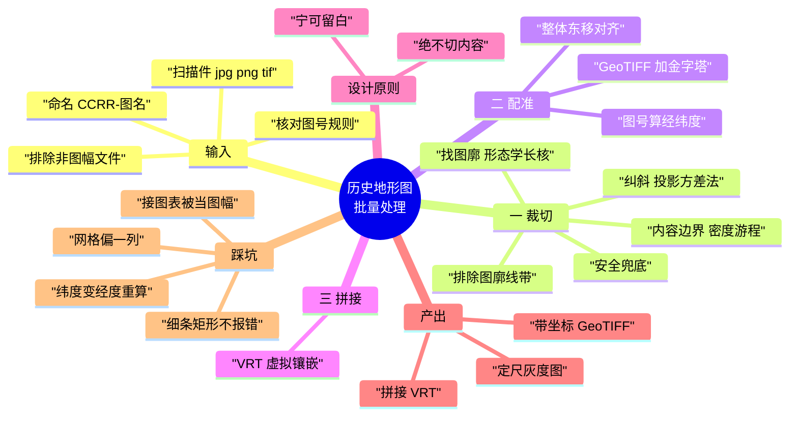
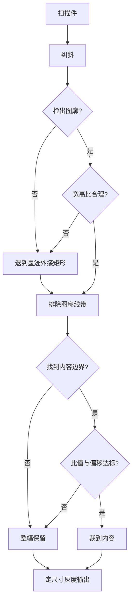
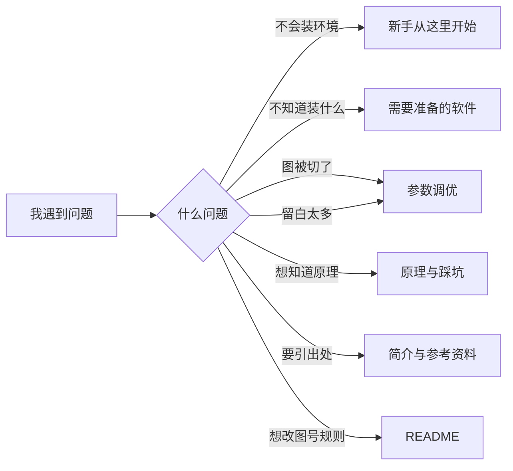

# 思维导图

三种格式，按用途取用：

- **① Mermaid 源码** —— 支持 mermaid 的平台（GitHub、Obsidian、Typora、语雀）直接贴
- **② Markdown 大纲** —— 可直接导入 XMind / 幕布 / MindNode
- **③ 纯文本树** —— 贴在文档或代码注释里

> ⚠ **知乎不支持 mermaid**。要发知乎或小红书，请到 <https://mermaid.live>
> 粘贴源码 → Actions → PNG，导出图片再上传。
> GitHub 的 Markdown **原生支持 mermaid**，直接贴进 `.md` 即可渲染。

---

## ① Mermaid 源码

### 主图：方案全貌



### 副图一：裁切阶段的判断逻辑

这张最能说明设计意图——**三条通往"整幅保留"的路径**，就是"绝不切内容"的落地形式。



### 副图二：文档导航



---

## ② Markdown 大纲（可导入 XMind / 幕布）

```markdown
# 历史地形图批量处理

## 输入
### 扫描件
- 格式 jpg / png / tif
- 状态：歪斜、带黑边、有纸白边
- 无坐标信息
### 命名规则
- 格式 CCRR-图名.jpg
- 前两位 = 列号 C
- 后两位 = 行号 R
- 从图集接图表读取，不要猜
### 前置检查
- 核对图号规则与图廓注记
- 排除非图幅文件（接图表 / 封面 / 说明）
- 先单幅试跑

## 一、裁切
### 纠斜
- 投影方差法
- 缩略图 0.02 度步长搜索
- 与图框检测解耦
### 找图廓
- 形态学长核开运算
- 多阈值降级 0.30 到 0.07
- 合理性校验：宽高比 0.7 到 1.9
- 备选方案：霍夫变换加位置约束
### 排除图廓线带
- 默认 0.025 倍短边
### 内容边界
- 墨迹密度游程
- 阈值 0.10 / 连续窗口 20
### 安全兜底
- 内容识别失败则整幅保留
- 比值小于 0.72 则整幅保留
- 中心偏移超 0.15 则整幅保留

## 二、配准
### 图号换算
- west = origin_lon - step_lon × C
- south = origin_lat - step_lat × R
- 默认经差 15 分、纬差 10 分
### 整体东移
- 用于对齐现代底图
- Δlon = shift / (111320 × cos 纬度)
- 纬度变了必须重算
### 输出
- GeoTIFF，EPSG:4326
- 金字塔 2 4 8 16 32
- DEFLATE 压缩，nodata 255

## 三、拼接
### VRT 虚拟镶嵌
- 只是 XML 索引，不产生新数据
- 拖进 QGIS 即整片
- 手写 XML，不依赖 GDAL 绑定

## 设计原则
### 宁可留白，绝不切内容
- 裁掉的内容不可恢复
- 留白只是难看
- 所有不确定环节都倒向保守

## 产出
- 定尺寸灰度 PNG
- 带坐标 GeoTIFF
- 总镶嵌 VRT
- crop_report.json 处理报告

## 踩坑（共同点：都不报错）
- 图廓检出细条 4647×21
- 自适应阈值无区分度
- 均匀网格假设偏一整列 60px
- 纬度变了经度没重算，差 10 米
- 比对键不一致导致满屏假警报
- 接图表被当成一幅地图
- 自动筛查误报（省界 / 说明文字 / 河流）
- 批处理 GBK 编码与 CRLF 换行

## 文档导航
- 新手从这里开始 → 零基础操作
- 需要准备的软件 → 软件清单
- 参数调优 → 调参依据
- 原理与踩坑 → 为什么这么做
- 简介与参考资料 → 方法来源与引用
- 思维导图 → 本文件
```

---

## ③ 纯文本树

```
历史地形图批量处理
│
├─ 输入
│   ├─ 扫描件 (jpg/png/tif，歪斜带黑边，无坐标)
│   ├─ 命名 CCRR-图名  (前2位列号 C / 后2位行号 R)
│   └─ 前置  核对图号规则 · 排除非图幅 · 先单幅试跑
│
├─ 一、裁切
│   ├─ 纠斜        投影方差法，0.02° 步长
│   ├─ 找图廓      形态学长核开运算 + 多阈值降级
│   ├─ 排线带      默认 0.025 倍短边
│   ├─ 内容边界    墨迹密度游程 (阈值 0.10 / 窗口 20)
│   └─ 安全兜底    失败 或 比值<0.72 或 偏移>0.15 → 整幅保留
│
├─ 二、配准
│   ├─ 图号换算    west = origin_lon − step_lon×C
│   ├─ 整体东移    Δlon = shift / (111320×cos φ)  ← 纬度变了要重算
│   └─ 输出        GeoTIFF + 金字塔 2/4/8/16/32
│
├─ 三、拼接
│   └─ VRT 虚拟镶嵌 (XML 索引，零磁盘占用)
│
├─ 设计原则
│   └─ 宁可留白，绝不切内容
│
├─ 产出
│   ├─ 定尺寸灰度 PNG
│   ├─ 带坐标 GeoTIFF
│   ├─ 总镶嵌 VRT
│   └─ crop_report.json
│
└─ 踩坑 (共同点：都不报错)
    ├─ 图廓检出细条 4647×21
    ├─ 自适应阈值无区分度
    ├─ 均匀网格偏一整列 60px
    ├─ 纬度变了经度没重算，差 10 米
    ├─ 比对键不一致 → 满屏假警报
    ├─ 接图表被当成一幅地图
    ├─ 自动筛查误报
    └─ GBK 编码与 CRLF 换行
```

---

## 怎么用

| 场景 | 用哪个 |
|---|---|
| 贴在 GitHub README / Obsidian | ① Mermaid 主图（GitHub 原生渲染） |
| 自己梳理、做汇报 | ② 导入 XMind，可自由展开折叠 |
| 发知乎 / 小红书 | ① 去 mermaid.live 导出 PNG |
| 贴在代码注释或纯文本环境 | ③ 纯文本树 |
| 给人讲解流程 | ① 副图一（裁切判断逻辑）最直观 |

**做汇报的话**，建议把「裁切判断逻辑」那张流程图放在前面——
它一眼就能说明"这个工具在什么情况下会保守、什么情况下会激进"，
比讲参数更容易让人理解设计意图。
